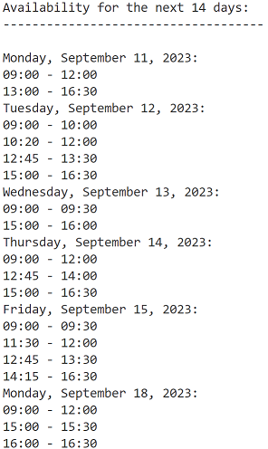

# Google Time Finder Quickstart

This quickstart guide helps you set up a Python command-line application to interact with the Google Calendar API. The script fetches the available time slots (minimum `30 minutes`) from your Google Calendar for the next 14 days, excluding weekends, and within the working hours specified in the script.

Here is a screenshot that illustrates what you can use.



# Why is this Useful? 🌟

If you're on the hunt for a new job, swiftly and efficiently scheduling meetings can be a lifesaver. Here's why this tool is a must-have for job seekers:

1. **Speedy Scheduling 🚀**: Instantly find and share your available slots, accelerating the scheduling process and impressing potential employers.

2. **Professional Touch 💼**: Show off your organizational skills and respect for recruiters' time by providing your availability promptly.

3. **Personalized Settings ⏰**: Define your ideal hours and break times for interviews, ensuring you're at your best for every meeting.

4. **Google Calendar Integration 📅**: If you're already a Google Calendar user, this tool will integrate with your existing setup, making the transition seamless.

5. **Privacy-First 🛑**: Operate the script locally to keep your data secure and private.

This tool is designed to streamline the job search process, offering a quick, easy way to schedule meetings without the headache. It's all about helping you to focus on what really matters - landing your dream job.


## Prerequisites

- Python 3.10.7 or higher
- Pip package management tool
- Google Cloud project
- A Google account with Google Calendar enabled

## Getting Started

### 1. Environment Setup

#### 1.1 Enable the Google Calendar API

Navigate to your [Google Cloud console](https://console.cloud.google.com/) and enable the Google Calendar API.

#### 1.2 Configure the OAuth Consent Screen

In the Google Cloud console:
- Navigate to `Menu > APIs & Services > OAuth consent screen`.
- Select your user type and click "Create".
- Complete the app registration form and click "Save and Continue".
- If prompted, add test users by clicking "Add Users" under "Test users".
- Review your app registration and click "Back to Dashboard".

### 2. Authorize Credentials

In the Google Cloud console:
- Go to `Menu > APIs & Services > Credentials`.
- Click "Create Credentials" and select "OAuth client ID".
- Choose "Desktop app" as the application type and provide a name for your credential.
- Click "Create" and download the JSON file as `credentials.json`, moving it to the `keys` directory.

### 3. Install the Client Library

Run the following command to install the necessary Python libraries:

```
python -m venv .venv
pip install -r requirements.txt
```

## Usage

### 1. Set Working Hours and Breaks

In the script, specify your working hours and break times by modifying the `working_hours_start`, `working_hours_end`, and `breaks` variables.

### 2. Running the Script

Navigate to your project directory in a terminal and run the script using:

```sh
python main.py
```

The script will output your available time slots for the next 14 working days based on the events in your Google Calendar.

### 3. Authentication

On the first run, the script will open a new window in your default web browser asking you to authorize the app to access your Google Calendar data. Log in with your Google account and grant the necessary permissions. The script will save a `token.json` file in your `keys` directory to store the authentication credentials.


For further customization or troubleshooting, refer to the [Google Calendar API documentation](https://developers.google.com/calendar/api/quickstart/python).
